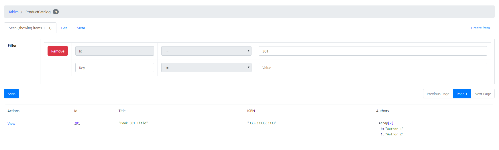

# dynamoDB の CRUD 操作

## repository クラスの作成

`com.haruspring.sample.dynamodb.sdk.repository.ProductCatalogRepository`クラスを作成する。DynamoDB のクライアントオブジェクトを取得するための private メソッドを作成しておく。

```java
/**
 * ProductCatalogテーブルに対応するリポジトリクラス。
 */
@Repository
public class ProductCatalogRepository {

  // @valueを使用してapplication.ymlからconfig情報を取得する。

  @Value("${amazon.dynamodb.endpoint}")
  private String amazonDynamoDBEndpoint;

  @Value("${amazon.aws.accesskey}")
  private String amazonAWSAccessKey;

  @Value("${amazon.aws.secretkey}")
  private String amazonAWSSecretKey;

  @Value("${amazon.dynamodb.region}")
  private String amazonDynamoDBRegion;

  /**
   * DynamoDB上のテーブル名
   */
  private static final String tableName = "ProductCatalog";

  /**
   * DynamoDBのクライアントを取得する。
   * @return AmazonDynamoDBオブジェクト
   */
  private AmazonDynamoDB getClient() {
    AmazonDynamoDB client =
        AmazonDynamoDBClientBuilder.standard()
            .withEndpointConfiguration(
                new EndpointConfiguration(amazonDynamoDBEndpoint, amazonDynamoDBRegion))
            .build();
    return client;
  }
```

## マッピング用クラスの作成

`com.haruspring.sample.dynamodb.sdk.repository.dao.ProductCatalogDao`をマッピングオブジェクトとして作成する。

```java
/**
 * ProductCatalogテーブルのマッピング用オブジェクト。
 * @author haruspring-jokt
 */
@Data // lombokのアノテーション
@DynamoDBTable(tableName="ProductCatalog") // 対応するテーブル名を宣言
public class ProductCatalogDao {

  // プライマリキーには@DynamoDBHashKeyを付与する。
  @DynamoDBHashKey(attributeName = "Id")
  private Integer id;

  private String brand;
  private String description;
  private Integer price;
  private Set<String> color;
  private String productCategory;

  @DynamoDBAttribute(attributeName = "Title")
  private String title;

  private String bicycleType;
  private Boolean inPublication;

  // 通常名前が一致するフィールドを作成すればよいが、@DynamoDBAttributeによって指定することもできる。
  @DynamoDBAttribute(attributeName = "ISBN")
  private String isbn;

  private Integer pageCount;

  @DynamoDBAttribute(attributeName = "Authors")
  private Set<String> authors;

  private String dimensions;

  // @DynamoDBIgnoreによってテーブル内のどの属性にもマッピングされないプロパティを含めることができる。
  @DynamoDBIgnore
  private String someProp;
}
```

## save

テーブルに1件保存する。

```java
  /** 1件のアイテムを追加する。 */
  public void saveItem() {
    DynamoDBMapper mapper = new DynamoDBMapper(getClient());

    ProductCatalogDao item = new ProductCatalogDao();

    item.setId(301);
    item.setTitle("Book 301 Title");
    item.setIsbn("333-3333333333");
    item.setAuthors(new HashSet<String>(Arrays.asList("Author 1", "Author 2")));
    item.setSomeProp("Test");

    mapper.save(item);
  }
```

実行すると1件のレコードが保存される。



## query

SQLで言うSQLECT文の発行。

```java
  /**
   * 1件のアイテムを取得する。
   */
  public void selectOne() {
    ProductCatalogDao partitionKey = new ProductCatalogDao();

    partitionKey.setId(301);
    DynamoDBQueryExpression<ProductCatalogDao> queryExpression =
        new DynamoDBQueryExpression<ProductCatalogDao>().withHashKeyValues(partitionKey);

    DynamoDBMapper mapper = new DynamoDBMapper(getClient());

    List<ProductCatalogDao> itemList = mapper.query(ProductCatalogDao.class, queryExpression);

    for (ProductCatalogDao productCatalogDao : itemList) {
      System.out.println(productCatalogDao.getTitle());
      System.out.println(productCatalogDao.getAuthors());
    }
  }
```

```
Book 301 Title
[Author 1, Author 2]
```


